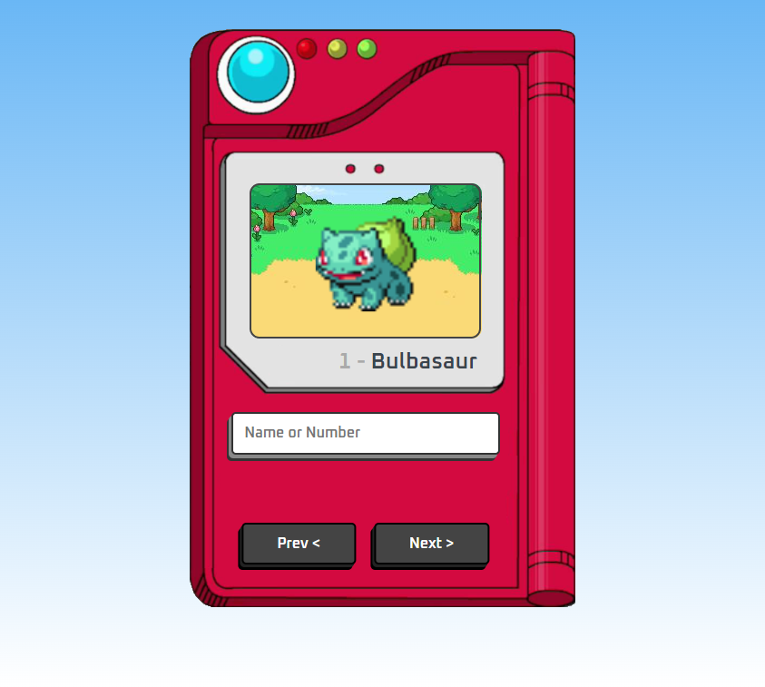

# Pokédex

> Projeto Pessoal

Mini projeto construído com o objetivo de tornar "real" a utilização de um pokédex. Além de pôr em prática conhecimentos básicos de ferramentas do javascript, css e comuicação com API

[🔗Clique aqui para acessar](https://pokedex-livid-omega.vercel.app/)

## 🛠️Tecnologias

- HTML
- CSS
- Git e Github

## 💖Contato

gabriel_nobresantos@hotmail.com
